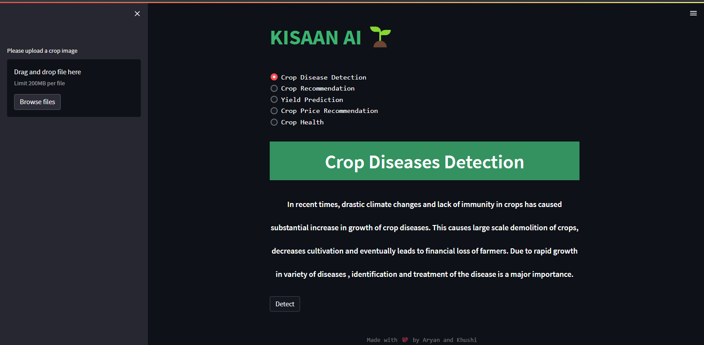

# KISAAN AI - A Farmer's Friend



Kissan AI is a web-based application that uses Artificial Intelligence (AI) to help farmers solve real-world problems they face in agriculture. The application is designed to be user-friendly, making it easy for farmers to access and use the different features provided.

---


## Features

| Feature | Description |
| --- | --- |
| Crop Yield Prediction | Predicts the net crop yield based on the input received from the farmer. |
| Crop and Disease Detection | Checks whether the grown crop is infected or healthy by using AI image processing techniques. |
| Crop Recommendation | Suggests which crops to cultivate by monitoring site-specific features of the farmer's field. |
| Crop Price Recommendation | Uses an AI model to propose a price at which the farmer should market their produce to maximize earnings. |
| Crop Health | Determines whether the crop is healthy and alive or has been damaged by pesticides or any other reasons. |

---

## Feature Preview

<video src="./assets/KissanAI.mp4" width="100%" height="100%" controls preload></video>

<!-- ## How it Works

Kissan AI uses AI to solve the problems faced by farmers. The application uses a combination of machine learning and deep learning techniques to provide farmers with valuable insights and recommendations that can help them make informed decisions about their crops. The application is designed to be user-friendly, making it easy for farmers to access and use the different features provided.

1. Crop Yield Prediction
One of the primary concerns of farmers is predicting the yield of their crops. Kissan AI addresses this issue by predicting the net crop yield based on the input received from the farmer. This feature allows farmers to plan ahead and make informed decisions about their crops.

2. Crop and Disease Detection
Another challenge farmers face is identifying crop diseases and taking prompt action to prevent their spread. Kissan AI checks whether the grown crop is infected or healthy by using AI image processing techniques. This feature enables farmers to detect any signs of disease early, reducing the likelihood of crop failure.

3. Crop Recommendation
Kissan AI suggests which crops to cultivate by monitoring site-specific features of the farmer's field. This feature addresses crop selection issues, taking into account factors such as soil quality, climate, and weather patterns. This feature helps farmers choose the best crop for their land, reducing the likelihood of crop failure.

4. Crop Price Recommendation
Kissan AI uses an AI model to propose a price at which the farmer should market their produce to maximize earnings. This feature considers factors such as the current market demand and supply, production costs, and other relevant market data. Farmers can use this feature to ensure they get a fair price for their produce, reducing the risk of selling their crops at a loss.

5. Crop Health
Determining the outcome of the harvest season is crucial for farmers. Kissan AI helps farmers determine whether their crop is healthy and alive or has been damaged by pesticides or any other reasons. This feature enables farmers to take prompt action to address any issues, improving the quality and quantity of their harvest. -->

---
## Installation

- Clone the repository
```bash
git clone repo_url
```

- Install Python 3.9 or below

- Install the dependencies
```bash
pip install -r requirements.txt
```
- Run the application
```bash
streamlit run app.py
```

---

## Conclusion

Kissan AI is a tool for farmers, providing valuable insights and recommendations that can help them make informed decisions about their crops. By leveraging AI, Kissan AI aims to improve the efficiency and productivity of agriculture, making farming a more profitable and sustainable endeavor.